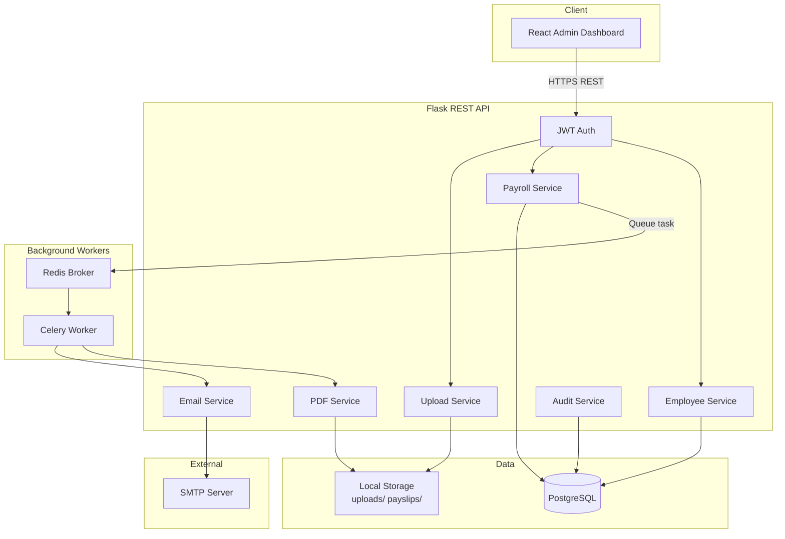

# Architecture

## System Overview

## Request Flow

### 1. Upload & Preview (synchronous)

1. Admin uploads CSV/Excel via dashboard.
2. Flask saves file to `storage/uploads/`.
3. pandas parses file; services validate rows.
4. Preview JSON returned; admin confirms commit.

### 2. PDF Generation (asynchronous)

1. Admin triggers generation for a payroll batch.
2. API creates `PayslipJob`, enqueues Celery task, returns `202`.
3. Worker loads payroll records, maps employees by `employee_id`.
4. Jinja2 renders HTML → WeasyPrint (or ReportLab fallback) writes PDFs to `storage/payslips/job_{id}/`.
5. Job status and audit log updated.

### 3. Email Dispatch (asynchronous)

1. Admin triggers dispatch after PDF job completes.
2. Celery sends one email per payslip via SMTP with HTML body + PDF attachment.
3. `email_deliveries` tracks sent/failed/pending per document.

## Service Layer

| Service | Responsibility |
|---------|----------------|
| EmployeeService | Master data CRUD, upload validation |
| PayrollService | Monthly payroll batches, net salary calculation |
| UploadService | File persistence, allowed extensions |
| PDFGenerationService | Template render, PDF output |
| EmailService | SMTP delivery, HTML templates |
| AuditService | Immutable activity log |

## Security

- JWT bearer tokens for all admin endpoints (8h expiry).
- bcrypt password hashing for admin accounts.
- CORS enabled for local dev frontend origin.

## Deployment Notes

- Run `docker-compose up` for PostgreSQL + Redis.
- Run Flask (`run.py`), Celery worker, and Vite dev server separately.
- Configure SMTP via environment variables before email dispatch.
