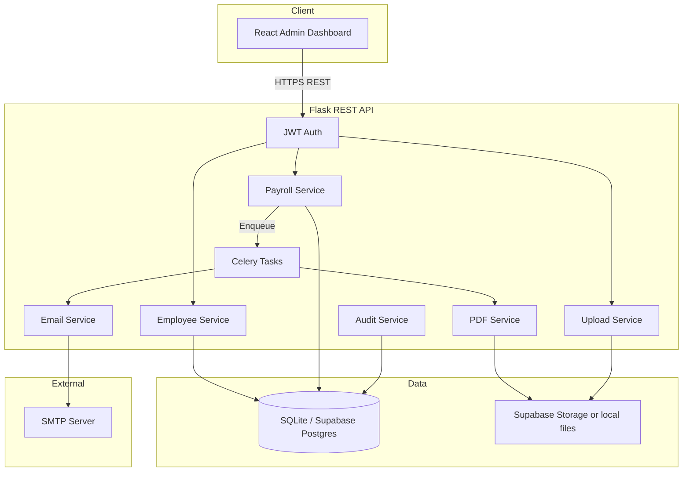

# Architecture

## System Overview

**Default (no Docker, no Redis):** `CELERY_TASK_ALWAYS_EAGER=true` runs PDF and email tasks inside the Flask process when the admin clicks generate/dispatch.

**Optional async:** Set `CELERY_TASK_ALWAYS_EAGER=false`, run Redis, and start a Celery worker process.

## Request Flow

### 1. Upload & Preview (synchronous)

1. Admin uploads CSV/Excel via dashboard.
2. File is stored in Supabase Storage or `storage/uploads/`.
3. pandas parses and validates rows.
4. Preview JSON returned; admin confirms commit.

### 2. PDF Generation

1. Admin triggers generation for a payroll batch.
2. API creates `PayslipJob` and runs the Celery task (inline or via worker).
3. Jinja2 → WeasyPrint/ReportLab → PDF stored in Supabase or `storage/payslips/`.
4. Job status and audit log updated.

### 3. Email Dispatch

1. Admin triggers dispatch after PDF job completes.
2. One email per payslip via SMTP with HTML body + PDF attachment.
3. `email_deliveries` tracks sent/failed/pending.

## Service Layer

| Service | Responsibility |
|---------|----------------|
| EmployeeService | Master data CRUD, upload validation |
| PayrollService | Monthly payroll batches, net salary calculation |
| UploadService | File persistence |
| StorageService | Supabase Storage or local disk |
| PDFGenerationService | Template render, PDF output |
| EmailService | SMTP delivery |
| AuditService | Activity log |

## Security

- JWT bearer tokens for admin endpoints (8h expiry).
- bcrypt password hashing for admin accounts.
- Supabase **service_role** key only on the server.

## Local runtime

1. `python run.py` — API + inline background tasks
2. `npm run dev` — frontend

No containers required. Use Supabase for hosted Postgres and file storage in production.
