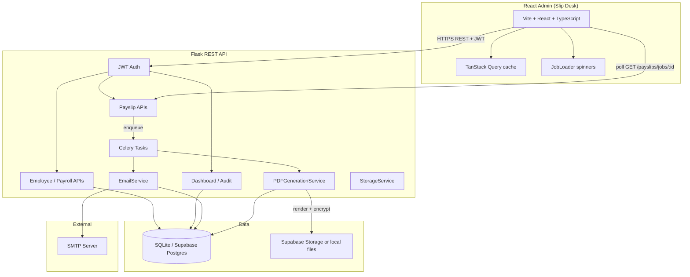
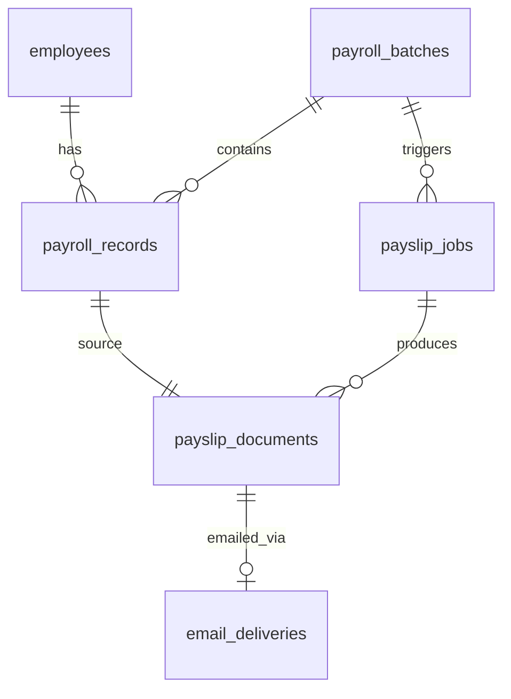

# Architecture

## System Overview

**Slip Desk** is an admin portal for employee roster management, monthly payroll ingestion, payslip PDF generation, download, and SMTP email dispatch.



### Runtime modes

| Mode | Config | Behaviour |
|------|--------|-----------|
| **Inline (default)** | `CELERY_TASK_ALWAYS_EAGER=true` | PDF and email tasks run inside the Flask request. No Redis required. |
| **Async (optional)** | `CELERY_TASK_ALWAYS_EAGER=false` + Redis + Celery worker | Tasks run in a background worker; API returns `202` immediately. |

On Vercel, the backend uses serverless-friendly settings (lazy DB init, `NullPool`, no Supabase bucket checks at import time).

## Frontend

| Area | Location | Notes |
|------|----------|-------|
| Routing | `frontend/src/App.tsx` | `/`, `/employees`, `/payroll`, `/audit`; JWT gate via `PrivateRoute` |
| Auth | `frontend/src/lib/auth.ts` | Token in `localStorage`, client-side expiry check, 401 → login + query cache clear |
| Data fetching | `frontend/src/lib/queries.ts` | TanStack Query keys, prefetch in `AppLayout`, invalidation after uploads/jobs |
| Payroll jobs | `frontend/src/pages/PayrollPage.tsx` | Polls `GET /payslips/jobs/:id` every 1s during PDF/email phases |
| Job feedback | `frontend/src/components/JobLoader.tsx` | Circular spinner while work is in progress (no percentage bar) |
| Samples | `frontend/public/samples/` | Downloadable CSV templates on Employees & Payroll pages |

### Why spinners instead of progress bars

With eager Celery, PDF generation and email dispatch often complete inside a single HTTP request. The UI still polls job status in parallel, but intermediate counts may not arrive in time. **JobLoader** shows an indeterminate spinner during active phases; completion is reflected via job status text and email summary lines.

## Request Flows

### 1. Upload & preview (synchronous)

1. Admin uploads CSV/Excel via the dashboard.
2. `UploadService` stores the file in Supabase Storage or `backend/storage/uploads/`.
3. `file_parser` + validators parse rows; preview JSON is returned.
4. On commit, rows are persisted to `employees` or `payroll_batches` / `payroll_records`.

**Net salary:** `Base + HRA + Allowances − Deductions` (validated on upload).

### 2. PDF generation

1. Admin clicks **Generate PDFs** for a payroll batch.
2. API creates a `PayslipJob` (`status=queued`) and calls `generate_payslips_task.delay()`.
3. Task sets `status=processing`, iterates payroll records, and for each:
   - Renders `payslip.html` via Jinja2 → WeasyPrint (local) or ReportLab (Vercel).
   - Derives password via `pdf_password.payslip_pdf_password(name, birth_year, employee_id)`.
   - Encrypts PDF bytes with `pypdf` (`encrypt_pdf_bytes`).
   - Stores file via `StorageService`; updates `PayslipDocument` and job counters.
4. Job finishes as `completed` or `completed_with_errors`; audit log entry written.
5. Frontend polls job endpoint until terminal status; **JobLoader** hides when done.

**Password formula:** first 4 letters of employee name (lowercase) + `birth_year`  
Example: Johny, 1996 → `john1996`  
Fallback (no birth year): name prefix + alphanumeric `employee_id`.

### 3. Email dispatch

1. Admin clicks **Send payslip emails** after PDF job completes.
2. API calls `EmailService.prepare_pending_deliveries(job_id)` — creates `email_deliveries` rows in `pending` state before send starts (so polling can report totals).
3. `dispatch_emails_task.delay()` sends one SMTP message per generated payslip:
   - HTML body from `email.html` (includes PDF password).
   - PDF attachment from storage.
   - Updates each `EmailDelivery` to `sent` or `failed`.
4. Frontend starts polling **before** the dispatch POST returns; **JobLoader** shows while `emailRunning`; summary line shows sent/failed when complete.

### 4. Download

- Single PDF: `GET /payslips/documents/:id/download`
- ZIP of all generated PDFs for a job: `GET /payslips/jobs/:id/download`

## API Surface

All routes under `/api`, JWT-protected except login and health.

| Module | Prefix / routes | Purpose |
|--------|-----------------|---------|
| `auth` | `POST /auth/login` | Admin login, JWT issue |
| `employees` | `/employees/*` | Roster CRUD, CSV upload preview/commit |
| `payroll` | `/payroll/*` | Batch upload preview/commit, list batches |
| `payslips` | `/payslips/generate`, `/payslips/dispatch`, `/payslips/jobs/:id`, downloads | PDF jobs, email dispatch, status polling |
| `dashboard` | `/dashboard/summary` | Overview counts |
| `audit` | `/audit` | Activity log |

## Service Layer

| Service | Responsibility |
|---------|----------------|
| `EmployeeService` | Master data CRUD, upload validation |
| `PayrollService` | Monthly payroll batches, net salary calculation |
| `UploadService` | Upload file persistence |
| `StorageService` | Supabase Storage or local disk abstraction |
| `PDFGenerationService` | Jinja2 render, PDF output, encryption hook |
| `EmailService` | Pending delivery prep, SMTP send, delivery stats |
| `PayslipService` | Job document listing |
| `AuditService` | Activity log |
| `AuthService` | Admin authentication |

## Data Model (core entities)



| Table | Role |
|-------|------|
| `employees` | Roster (`employee_id`, name, email, `birth_year`, …) |
| `payroll_batches` | Monthly upload grouping (month, year) |
| `payroll_records` | Salary line items per employee per batch |
| `payslip_jobs` | Async job tracker (`status`, `completed`, `failed`, `total`) |
| `payslip_documents` | Generated PDF metadata and storage path |
| `email_deliveries` | Per-document send status (`pending` / `sent` / `failed`) |
| `audit_logs` | Admin actions |

Schema SQL: [`docs/schema.sql`](schema.sql).

## Security

- JWT bearer tokens for admin endpoints (8h expiry); frontend validates `exp` before routing.
- bcrypt password hashing for admin accounts.
- Payslip PDFs encrypted at rest in storage; password communicated only via email body to the employee.
- Supabase **service_role** key used only on the server; never exposed to the client.
- CORS configured for the frontend origin (local dev proxy or `VITE_API_URL` in production).

## Deployment (Vercel)

Two separate Vercel projects:

| Project | Root | Entry / build |
|---------|------|---------------|
| Backend | `backend/` | `main.py`, `requirements-vercel.txt`, `vercel.json` |
| Frontend | `frontend/` | Vite build, `VITE_API_URL` → backend URL, SPA rewrites in `vercel.json` |

Production expects Supabase Postgres + Storage (see [`supabase-storage.md`](supabase-storage.md)). Run `docs/schema.sql` before first deploy.

Health check: `GET /api/health` → `{"status":"ok"}`.

## Local Runtime

1. `cd backend && python run.py` — API on port 5000 (inline Celery tasks).
2. `cd frontend && npm run dev` — UI on port 5173, `/api` proxied to backend.

No Docker or Redis required for local development. Optional: `requirements-dev.txt` for WeasyPrint and pandas locally.

## Project Layout

```
backend/
├── main.py              Vercel / production entry
├── run.py               Local dev server
├── app/
│   ├── api/             REST blueprints
│   ├── models/          SQLAlchemy models
│   ├── services/        Business logic (PDF, email, storage, …)
│   ├── tasks/           Celery task definitions
│   ├── templates/       payslip.html, email.html
│   └── utils/           Validators, file parser, pdf_password
frontend/
├── src/
│   ├── pages/           Dashboard, Employees, Payroll, Audit, Login
│   ├── components/      JobLoader, DataTable, layout, UI primitives
│   └── lib/             api, auth, queries
samples/                 Example CSV files
docs/                    Schema, architecture, Supabase notes
```
